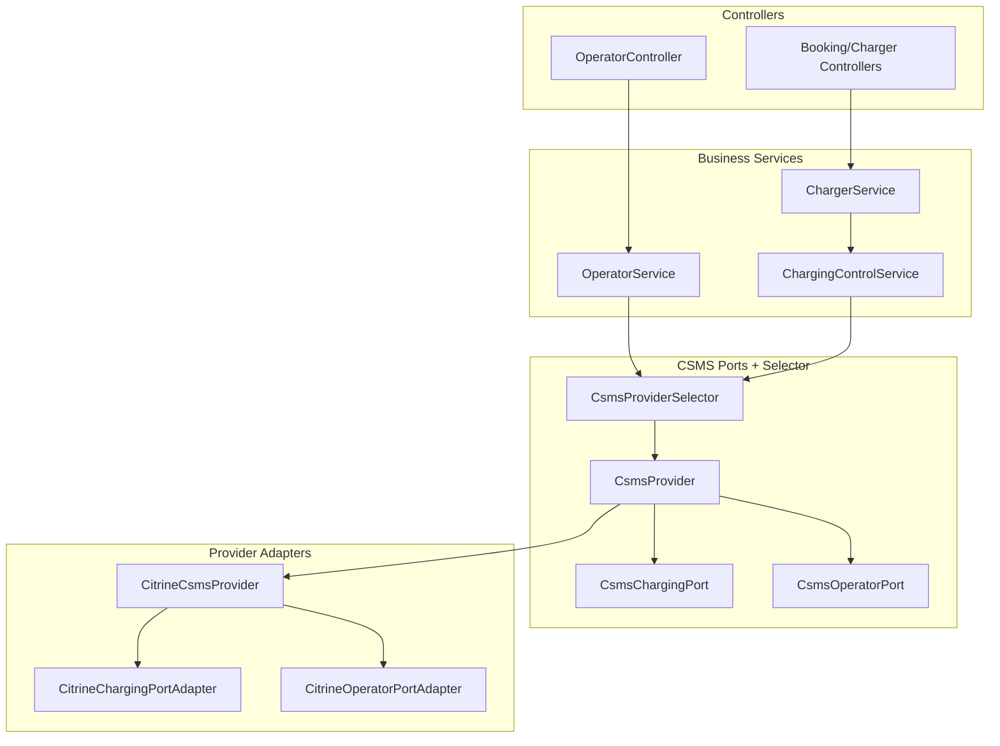

# Karocharge backend — CSMS-agnostic architecture + test APIs

This backend is designed to be **CSMS-provider agnostic** (Clean Architecture / Ports & Adapters). You can **replace or add a CSMS** without changing business services or controllers—only by implementing a new provider adapter and updating configuration.

This README covers:
- the **backend architecture** (where CSMS code lives)
- **how to add/replace a CSMS**
- existing **test APIs** and how they map to the current provider (Citrine + VCP simulator behavior)

---

## Backend architecture (CSMS-agnostic)

### Layering (what can depend on what)
- **Controllers (`com.karocharge.backend.controller`)**: expose REST APIs, no provider logic
- **Business services (`com.karocharge.backend.service`)**: orchestrate booking/charging/operator flows using CSMS ports
- **CSMS ports (`com.karocharge.backend.integration.csms.*`)**: provider-neutral interfaces + selector
- **Provider adapters (`com.karocharge.integration.*`)**: provider-specific HTTP/WS/GraphQL clients, payload mapping, auth

### Provider selection (configuration-driven)
The active provider is selected by `csms.provider` in `src/main/resources/application.yml`.

```yaml
csms:
  provider: ${CSMS_PROVIDER:default}
```

At runtime:
- business code calls `CsmsProviderSelector.current()`
- the selector returns the provider whose `CsmsProvider#providerKey()` matches `csms.provider`

### Ports used by the business layer
- `CsmsChargingPort`: block/unblock/start/stop
- `CsmsOperatorPort`: live station/location views + base/ws URLs (operator UI)

### High-level diagram


---

## How to add/replace a CSMS (block/unblock/start/stop + live status)

The complete, step-by-step guide is in:
- `CSMS_PROVIDER_GUIDE.md`

### Quick checklist
1. **Create provider package**
   - `src/main/java/com/karocharge/integration/<providerKey>/...`

2. **Implement provider facade**
   - implement `com.karocharge.backend.integration.csms.CsmsProvider`
   - set `providerKey()` (example: `"vendorx"`)

3. **Implement charging port**
   - implement `com.karocharge.backend.integration.csms.ports.CsmsChargingPort`
   - provide: block/unblock/start/stop (and `defaultEvseId()`)

4. **Implement operator monitoring port**
   - implement `com.karocharge.backend.integration.csms.ports.CsmsOperatorPort`
   - provide: station/location reads and `websocketUrl()` for operator UI

5. **Configure + switch**
   - set `CSMS_PROVIDER=<providerKey>` (or set `csms.provider` directly)
   - add provider-specific env/config (base-url, websocket-url, auth, etc.)

6. **Do not edit business/services/controllers**
   - `ChargingControlService`, `OperatorService`, controllers and DTOs must remain provider-neutral.

---

## Ports

| Service | Port | Role |
|--------|------|------|
| **Karocharge backend** | `8091` | Your Spring Boot REST API (test routes under `/api/test/...`). |
| **CitrineOS HTTP API** | `8080` | CSMS REST surface the backend calls (`/ocpp/2.0.1/...`). |
| **CitrineOS OCPP WebSocket** | `8081` | CSMS forwards OCPP commands to the connected charge point (e.g. `CP-1`). |
| **VCP admin (optional)** | `9999` | Local admin port for the VCP simulator (if enabled in `.env`). |

Use **`CP-1`** as `{chargerId}` in backend URLs when your VCP is started with `chargePointId: CP-1` and connects to `ws://localhost:8081/CP-1`.

---

## Instructions (how to run a quick test)

1. **Start CitrineOS** (Docker stack) so HTTP `8080` and OCPP WS `8081` are up.
2. **Start the Karocharge backend** on port `8091`.
3. **Start the VCP** so it connects to Citrine on `8081` as `CP-1`.
4. Call the backend test APIs in order as needed (see below). Watch backend logs for `CITRINE_REQUEST` / `CITRINE_RESPONSE` and VCP logs for incoming OCPP actions.

---

## Backend test APIs (what you call)

Base URL: `http://localhost:8091`

| Your action | HTTP | Backend endpoint | Notes |
|-------------|------|------------------|--------|
| **Block** | `POST` | `/api/test/block/{chargerId}` | Optional query params: `userId` (default `test-user`), `sessionId`, `durationMinutes` (used for session bookkeeping in backend; Citrine call is availability-based). |
| **Unblock** | `POST` | `/api/test/unblock/{chargerId}` | Clears backend block state and sets charger **Operative** in Citrine. |
| **Start** | `POST` | `/api/test/start/{chargerId}` | Uses fixed test user `test-user` in the controller. |
| **Stop** | `POST` | `/api/test/stop/{chargerId}/{transactionId}` | `transactionId` must match the OCPP transaction id (UUID from VCP / session). |

**Examples**

```http
POST http://localhost:8091/api/test/block/CP-1
POST http://localhost:8091/api/test/unblock/CP-1
POST http://localhost:8091/api/test/start/CP-1
POST http://localhost:8091/api/test/stop/CP-1/<transactionId>
```

Optional block example with query params:

```http
POST http://localhost:8091/api/test/block/CP-1?userId=my-user&sessionId=booking-123&durationMinutes=60
```

---

## What each backend action does (explanation)

- **Block** — Marks the charger as **not available for charging** from the CSMS side using OCPP **ChangeAvailability** with **`Inoperative`**. The backend also keeps an in-memory “blocked” flag so **`/api/test/start/...` is rejected** until you unblock, even if the simulator is permissive.
- **Unblock** — Restores availability using **ChangeAvailability** with **`Operative`**, and clears the backend block flag so **start** is allowed again.
- **Start** — Asks Citrine to **remotely start** a transaction (**RequestStartTransaction**). The VCP begins a session and emits **TransactionEvent** / **StatusNotification** as implemented in the simulator.
- **Stop** — Asks Citrine to **remotely stop** the given **transactionId** (**RequestStopTransaction**). The VCP ends the transaction if it knows that id and sends the corresponding events.

---

## Backend → CitrineOS (which HTTP API is hit)

Citrine routes are called with query parameters (as in your integration):

- `identifier={chargerId}` (e.g. `CP-1`)
- `tenantId={tenantId}` (from config, default `1`)

| Backend test API | CitrineOS HTTP API hit | Request body (concept) |
|-------------------|------------------------|-------------------------|
| `POST /api/test/block/{chargerId}` | `POST /ocpp/2.0.1/configuration/changeAvailability` | `{ "operationalStatus": "Inoperative", "evse": { "id": <defaultEvseId> } }` — `defaultEvseId` is from `citrine.default-evse-id` (default `1`). |
| `POST /api/test/unblock/{chargerId}` | `POST /ocpp/2.0.1/configuration/changeAvailability` | `{ "operationalStatus": "Operative", "evse": { "id": <defaultEvseId> } }` |
| `POST /api/test/start/{chargerId}` | `POST /ocpp/2.0.1/evdriver/requestStartTransaction` | `remoteStartId`, `idToken` (`test-user` / `Central`), optional `evseId` when configured. |
| `POST /api/test/stop/{chargerId}/{transactionId}` | `POST /ocpp/2.0.1/evdriver/requestStopTransaction` | `{ "transactionId": "<transactionId>" }` |

Full Citrine URLs look like:

`http://localhost:8080/ocpp/2.0.1/... ?identifier=CP-1&tenantId=1`

---

## How the VCP reacts (OCPP 2.0.1 over `ws://localhost:8081/...`)

Citrine forwards the above as **incoming OCPP calls** to the connected charge point. For this repo’s **VCP 2.0.1** handlers:

| Citrine / OCPP action | VCP behavior (simulator) |
|------------------------|---------------------------|
| **ChangeAvailability** (`Inoperative`) | Responds **`Accepted`**. Sends **`StatusNotification`** with **`connectorStatus: Unavailable`** for the EVSE/connector from the payload (defaults EVSE `1`, connector `1` if omitted). |
| **ChangeAvailability** (`Operative`) | Responds **`Accepted`**. Does **not** automatically send an extra `StatusNotification` in the current handler (only the `Inoperative` branch sends one). |
| **RequestStartTransaction** | Responds **`Accepted`**, starts a simulated transaction, sends **`StatusNotification` (`Occupied`)** and **`TransactionEvent` (`Started`)**, then periodic **`TransactionEvent` (`Updated`)** with meter values. |
| **RequestStopTransaction** | If the **`transactionId`** is known: responds **`Accepted`**, sends **`TransactionEvent` (`Ended`)** and **`StatusNotification` (`Available`)**, and stops the transaction. If unknown: responds **`Rejected`**. |

**Note:** This VCP does **not** implement incoming **`CancelReservation`**. Blocking/unblocking in the current backend design uses **ChangeAvailability**, which matches what the simulator implements.

---

## Suggested test sequence

1. **Block** → VCP should show **ChangeAvailability** + **Unavailable** status.  
2. **Start** (without unblock) → backend should reject while blocked.  
3. **Unblock** → VCP should show **ChangeAvailability** `Operative`.  
4. **Start** → VCP should show **RequestStartTransaction** and transaction traffic.  
5. **Stop** with the **transaction id** from VCP logs → VCP should show **RequestStopTransaction** and **Ended** / **Available**.
